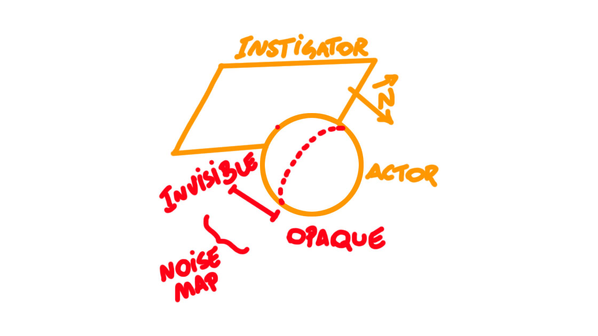
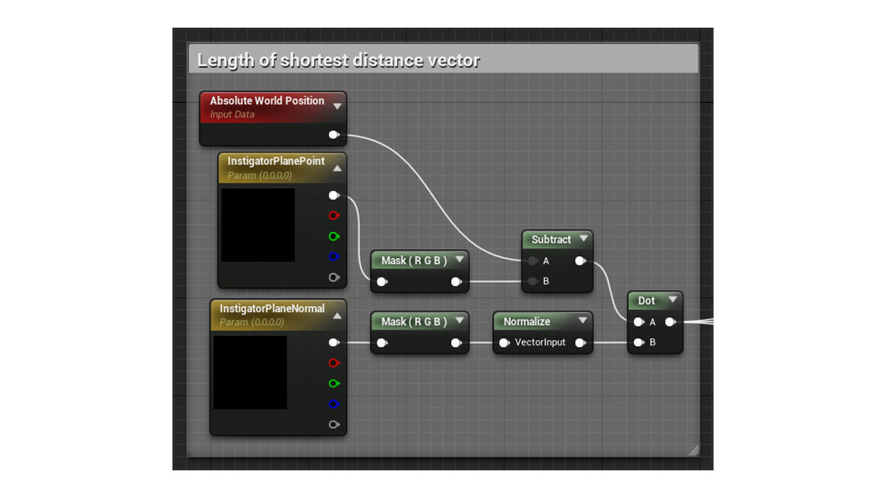
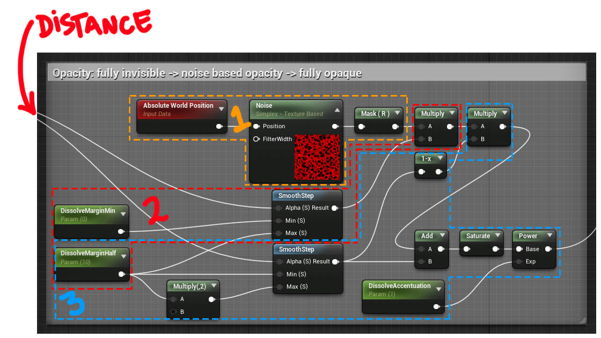

# Planar dissolve effect breakdown

This is one I've wanted to make since I first saw it. Seen some tutorials on YouTube, but none actually explained any of
the math or general tasks being performed so I decided to use whatever base knowledge I had to build one myself. This
note breaks down all my planning and implementation details. In the end, this is what we get:

In this case, "dissolving" the material (manipulating the opacity) and making it glow are two separate things, just
applied with similar parameters. I'll show you how I wen about creating the former first, then the latter, then how to
mix the two and *then* how to make the instigator plane/surface **dynamic.** (That is, material parameters corresponding
to the instigator plane are updated **automatically** based on the transform of an independent actor.)

#### Smoothly dissolving a surface

My game plan is: starting from the surface of the instigator plane and towards the object to be dissolved, start with
the object **completely masked** then smoothly transition into **completely opaque** passing by an area with **opacity
controlled by a noise texture.**

If you didn't quite get the game plan don't worry, it'll become very clear once we start laying out the shader graph.
Don't forget to set the material `Blend Mode` to `Masked` and set the `Opacity Mask Clip Value` to whatever you'd like.

Once again we'll rely on the length of the shortest distance vector (check out the [previous guide for the full
breakdown](https://github.com/dnery/ShaderStudies/tree/master/Squishy%20Material#quick-maths)) between the current texel
on the object's surface and the instigator plane.

Now for actually controlling the opacity, we'll rely on `SmoothStep` to transform our linear effect transition into a
smooth one. The latest versions of Unreal also allow us to bake the generated noise map into a texture, which would
otherwise fully procedural and therefore quite slow. It's very common to use a proper noise texture image and sample it
instead, but we're skipping the details for now.

1.  Using the aforementioned noise map; bake it to a texture by setting `Function` to `Simplex - Texture Based` (for the
Simplex noise of course, you may use another)
2.  The first `SmoothStep` goes from `DissolveMarginMin` to `DissolveMarginHalf`; it'll clamp values outside the range,
remap between `0` and `1`, and sample the actual `SmoothStep`. At `0` we want full transparency, and at `1` we want only
the noise to define the opacity, so we just multiply the noise sampling result by the result of this node
3.  The second `Smoothstep` just foes from `DissolveMarginHalf` to double that value so that the effect is evenly
spread; here, at `0` we want again only the noise to dominate, and at `1` we want the object to be fully opaque, at
which point the effect tapers off, so we just add it to the final result but multiply the previous noise result by the
complement to make sure our result stays between the `0` to `1` range.

Finally, we pass the result through a `Saturate` node, which is actually redundant considering we did the balancing
earlier already, and then attenuate with a `Power` node (remember, if the base is between `0` and `1`, any exponent
greater than `1` will make the value *exponentially smaller*). We can then control this attenuation with the
`DissolveAccentuation` param. (We *attenuate* the opacity, but *accentuate* the dissolve effect.)

To test what we have so far, plug the previous result into the `Opacity Mask` input of the result node, set the
instigator plane parameters `InstigatorPlanePoint` and `InstigatorPlaneNormal` (don't worry, we'll make them dynamic
soon enough), apply the material to a regular editor sphere and play around with it in the editor:

As you can see, we're able to completely dissolve the material if we move the actor far enough into the plane, and there
are no artifacts outside of the effective range of our effect. We can now move on to making the material glow.

#### Making the surface glow as it dissolves
