# Planar dissolve effect breakdown

This is one I've wanted to make since I first saw it. Seen some tutorials on YouTube, but none actually explained any of
the math or general tasks being performed so I decided to use whatever base knowledge I had to build one myself. This
note breaks down all my planning and implementation details. In the end, this is what we get:

In this case, "dissolving" the material (manipulating the opacity) and making it glow are two separate things, just
applied with similar parameters. I'll show you how I wen about creating the former first, then the latter, then how to
mix the two and *then* how to make the instigator plane/surface **dynamic.** (That is, material parameters corresponding
to the instigator plane are updated **automatically** based on the transform of an independent actor.)

#### Smoothly dissolving a surface

My game plan is: starting from the surface of the instigator plane and towards the object to be dissolved, start with
the object **completely masked** then smoothly transition into **completely opaque** passing by an area with **opacity
controlled by a noise texture.**

If you didn't quite get the game plan don't worry, it'll become very clear once we start laying out the shader graph.
Don't forget to set the material `Blend Mode` to `Masked` and set the `Opacity Mask Clip Value` to whatever you'd like.

Once again we'll rely on the length of the shortest distance vector (check out the [previous guide for the full
breakdown](https://github.com/dnery/ShaderStudies/tree/master/Squishy%20Material#quick-maths)) between the current pixel
on the object's surface and the instigator plane.

Now for actually controlling the opacity, we'll rely on `SmoothStep` to transform our linear effect transition into a
smooth one. The latest versions of Unreal also allow us to bake the generated noise map into a texture, which would
otherwise fully procedural and therefore quite slow. It's very common to use a proper noise texture image and sample it
instead, but we're skipping the details for now.

1.  Using the aforementioned noise map; bake it to a texture by setting `Function` to `Simplex - Texture Based` (for the
Simplex noise of course, you may use another)
2.  The first `SmoothStep` goes from `DissolveMarginMin` to `DissolveMarginHalf`; it'll clamp values outside the range,
remap between `0` and `1`, and sample the actual `SmoothStep`. At `0` we want full transparency, and at `1` we want only
the noise to define the opacity, so we just multiply the noise sampling result by the result of this node
3.  The second `Smoothstep` just goes from `DissolveMarginHalf` to double that value so that the effect is evenly
spread; here, at `0` we want again only the noise to dominate, and at `1` we want the object to be fully opaque, at
which point the effect tapers off, so we just add it to the final result but multiply the previous noise result by the
complement to make sure our result stays between the `0` to `1` range.

Finally, we pass the result through a `Saturate` node, which is actually redundant considering we did the balancing
earlier already, and then attenuate with a `Power` node (remember, if the base is between `0` and `1`, any exponent
greater than `1` will make the value *exponentially smaller*). We can then control this attenuation with the
`DissolveAccentuation` param. (We *attenuate* the opacity, /but *accentuate* the dissolve effect.)

To test what we have so far, plug the previous result into the `Opacity Mask` input of the result node, set the
instigator plane parameters `InstigatorPlanePoint` and `InstigatorPlaneNormal` (don't worry, we'll make them dynamic
soon enough), apply the material to a regular editor sphere and play around with it in the editor:

As you can see, we're able to completely dissolve the material if we move the actor far enough into the plane, and there
are no artifacts outside of the effective range of our effect. We can now move on to making the material glow.

#### Making the surface glow as it dissolves

The glow is applied in a very similar way, except we don't need 3 stages like before (in this version of the shader, of
course), the glow starts where the dissolve effect starts and then just tapers off:

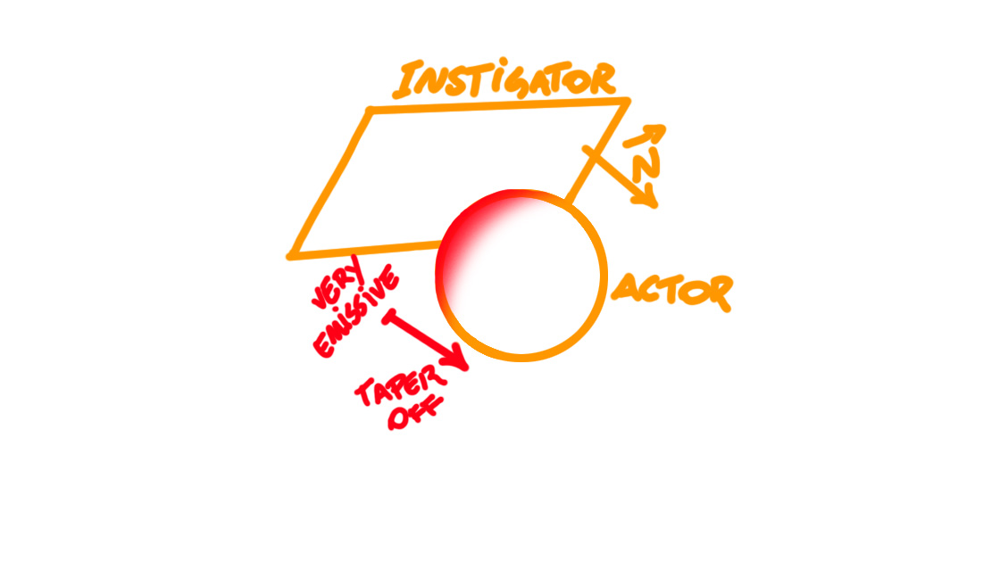

We just use one `SmoothStep` for the overall effect and use two parameters to vary and tweak the effect to our liking,
one to vary our effect *non-linearly* throughout the surface (`GlowAttenuation`), and another to vary it *linearly*
(`GlowMult`).

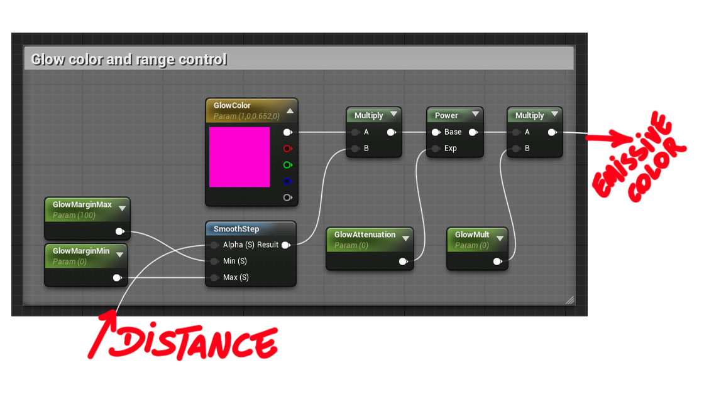

Visually, the best way to describe it is that one of the parameters (`GlowAttenuation`) will make our effect more
"extreme" near the limit values, and the other one (`GlowMult`) will vary it more "evenly." Anyway, plug this output
into `Emissive Color` in the output node and this is what we got:

In a more practical scenario however, the plane that instigates the effect would rarely be static. Next up we'll see
how to make it static. It goes outside the material creation side of things, but we'll still stick 100% to blueprints,
and it's a pretty interesting exercise.

#### Interacting dynamically with the instigator plane

There are several ways of doing this and the one I chose for this short tutorial probably wouldn't be a good choice in
practice, but also wouldn't be far from it. It's based on **component blueprints,** one for the instigator plane and
another for the dissolvable actor(s) to be specific. So here's the game plan:

*   "Dissolvable" actors will contain the `BP_Dissolvable` component in their hierarchy; this component will contain a
    function to update the actor's own material parameters, but the actor will not call the function themselves
*   The instigator planes will contain the `BP_Dissolver` component in their hierarchy; in this example there can only
    be one instigator and it will perform parameter update calls in all dissolvable actors
*   Upon starting the simulation, the instigator or "dissolver" will perform a query on all actors to see which ones
    contain the `BP_Dissolvable` component; it keeps that list and iterates through it every tick, calling updates
    on the material parameters of each one

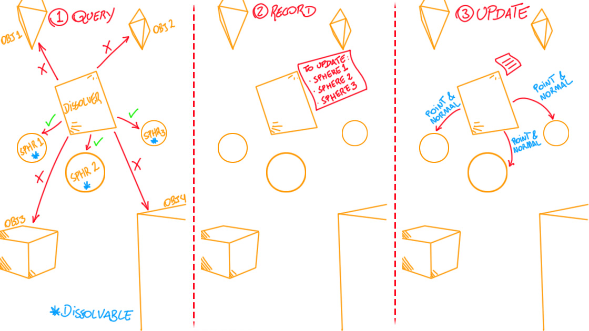

Remember that in the image above, the first 2 steps happen only upon beginning the simulation, the 3rd one repeats every
frame from the on. Now, create a new `Actor Component`, name it `BP_Dissolvable` and let's edit it:

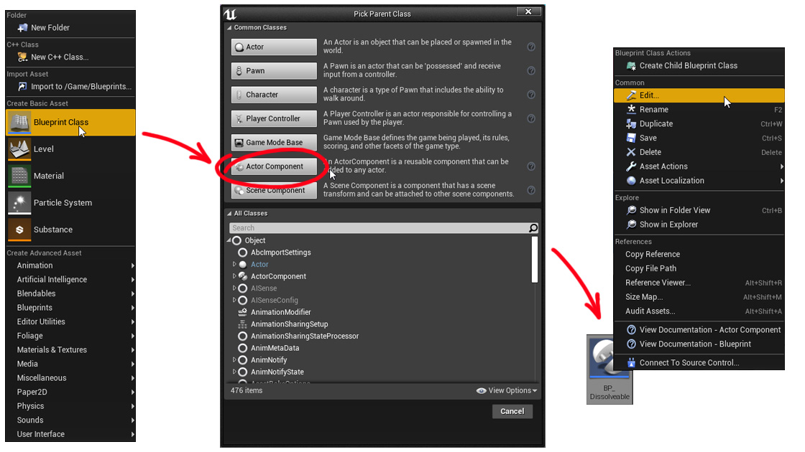

The actor to be dissolved will be mostly passive as we talked about, so leave the general event graph empty, create a
function to update the material parameters [of the material applied to the static mesh in the component hierarchy of
this actor]; in my cased I named it `UpdateDissolveMaterialParams` (click to view original):

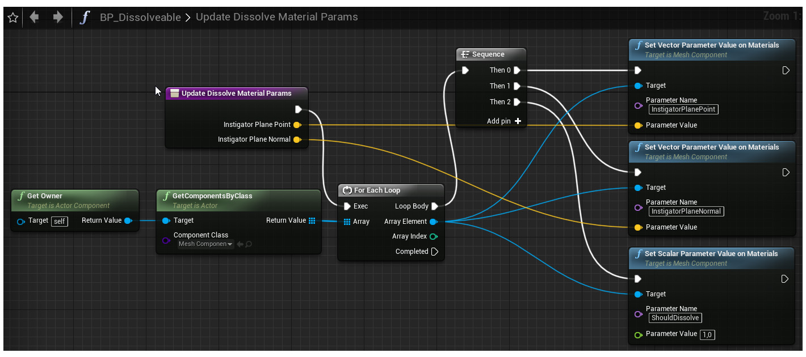

Noticed I also updated a `ShouldDissolve` parameter which I didn't mention yet. The reason for that is that I'd like a
boolean to programmatically control the active status of the effect. If we just rely parameters, we have to make sure
that they're in a value range that won't trigger the effect when we don't want it active, and that's somewhat error
prone. Just thinking about conditionals is simpler than accounting for all our possible value ranges.

Now, it'll be up to the instigator plane to call the above BP function. Create another `Actor Component`, name it
`BP_Dissolver` and open it up for editing. We'll need a variable in array format to keep track of all dissolvable actors
so go ahead and create a `DissolvableComponents` variable, set it to array format and set the type to `BP_Dissolvable`:

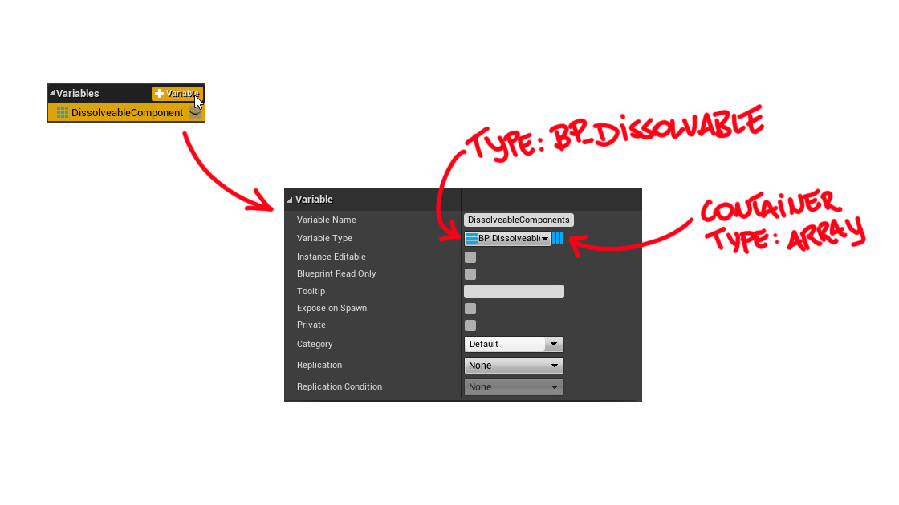

Now for the event graph:
*   `BeginPlay`: as already mentioned upon `BeginPlay` we'll perform the query and record the actionable actors,
    the only differences in the following implementation are that we'll be storing the actor components instead of actor
    references themselves (a minor optimization so that we don't have to track down the component inside the hierarchy
    every frame before calling the update function on it) and in my case, I also call the update function once already.
*   `Tick`: as for the `Tick` event we'll just iterate through the actionable actors and call the update function
    passing in the necessary parameters

Don't forget to click to expand!

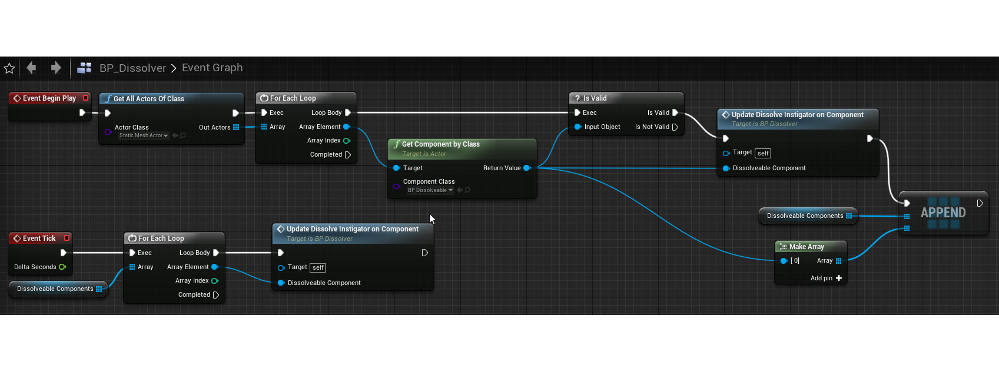

`UpdateDissolveInstigatorOnComponent` is just a function I created on the instigator itself, to encapsulate the sequence
of getting the needed parameters from the parent actor transform and sending it down the function call. (Towards the
dissolvable components.)

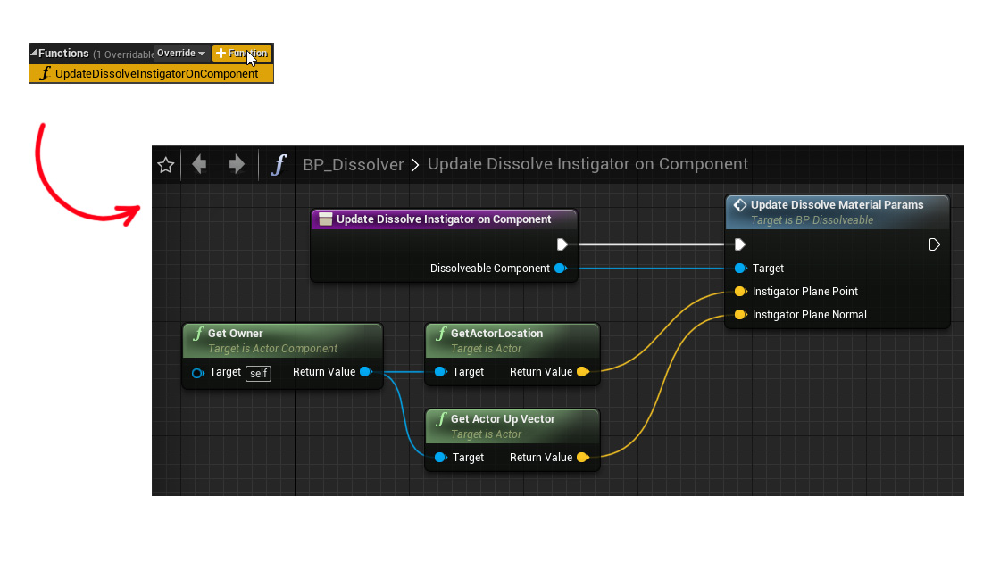

Now during simulation our instigator can move freely and the effect will be updated accordingly!

Just keep in mind that in your case, the plane normal might not be the `Actor Up` vector. Inside Unreal:
*   **X** or **Red** = **Actor Forward**
*   **Y** or **Green** = **Actor Right**
*   **Z** or **Blue** = **Actor Up**

Just change the transform gizmo to object local coordinates and make sure you're using the right vector:

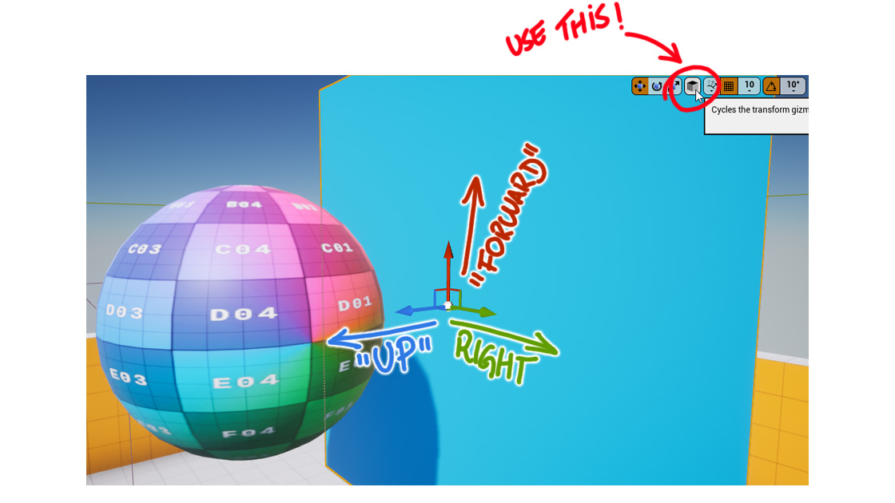

#### Applying the effect conditionally

To apply that `ShouldDissolve` boolean properly just requires a few tweaks to our material graph. The simplest and
ugliest way to do it is just use a `If` node to filter both the emissive and opacity results:

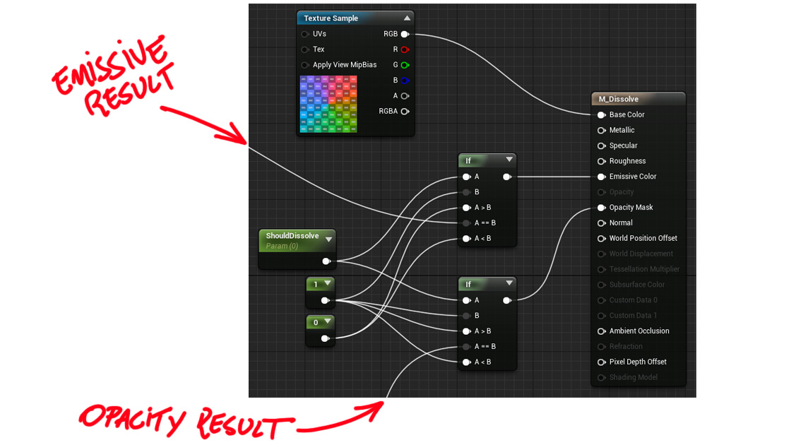

In my defense, any `If` node in the material graph will ever look "elegant." Anyway, key things to keep in mind here:
*   There's no problem in using conditionals in shader code, but try to use them sparingly
*   Trying to write the same logic in a "branchless" way might result in [way more complex machine code that the
    compiler might not be able to optimize well at all](https://www.youtube.com/watch?v=bVJ-mWWL7cE)
*   When in doubt go for the simple and more semantically sane choice; behaving predictably when writing code will allow
    the compiler to also behave reliably

Anyway, here's a bird's eye view of our final material graph:

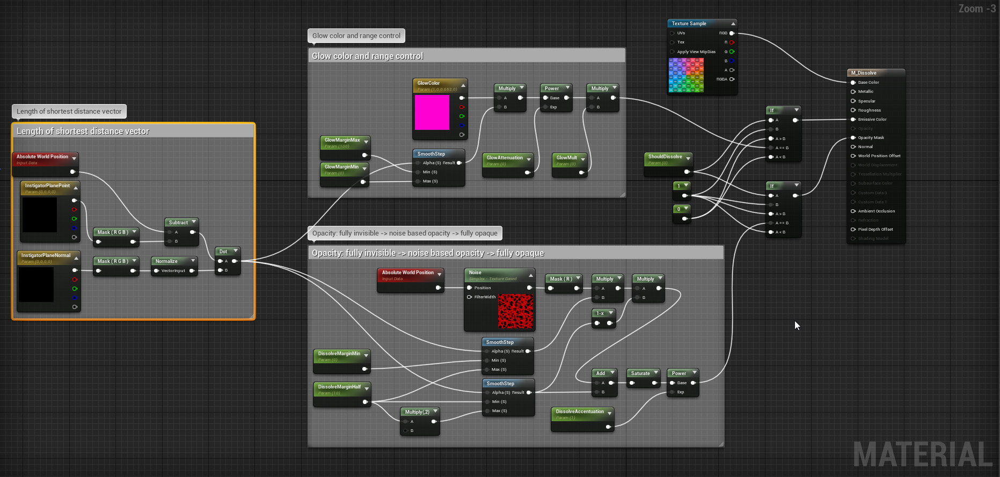

And how the final version behaves:

You can see that now, outside of simulation our effect is not applied!

