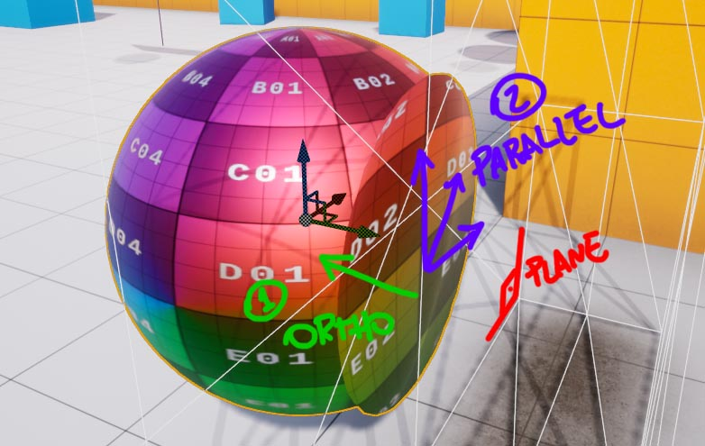
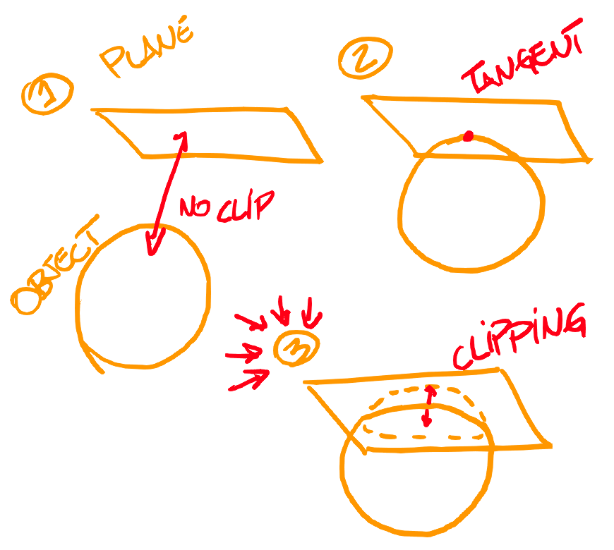
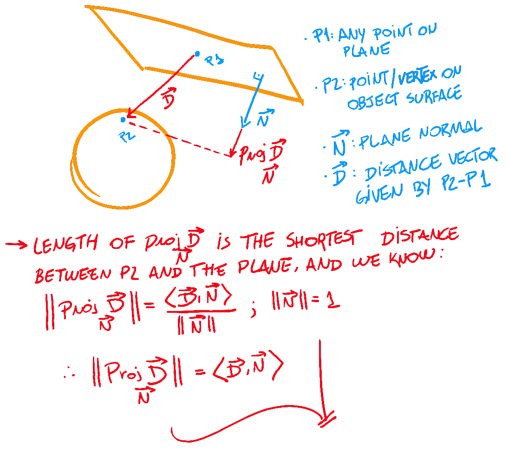
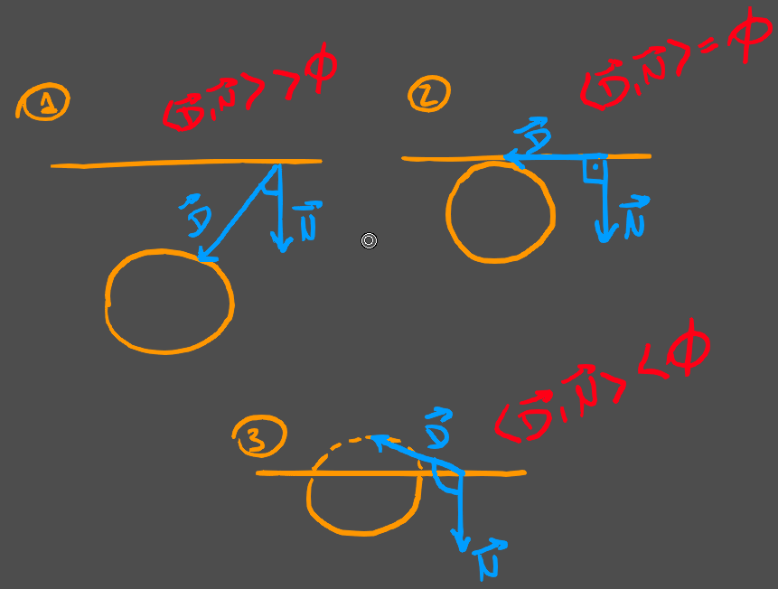
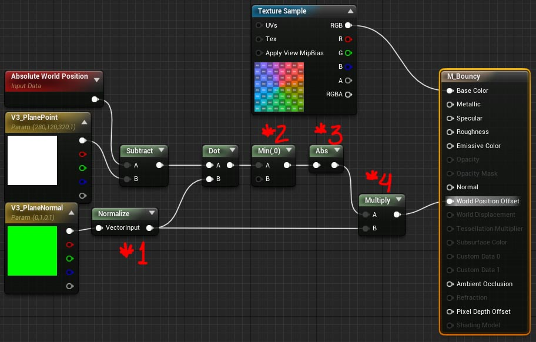
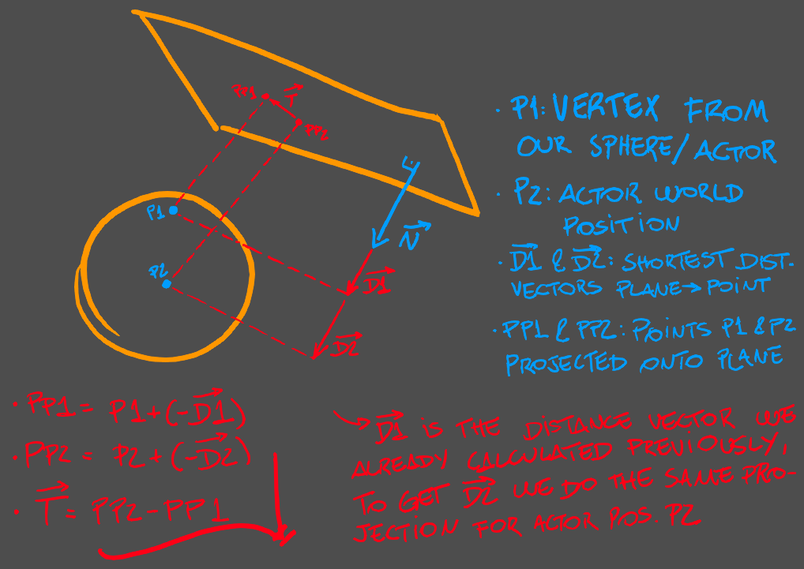
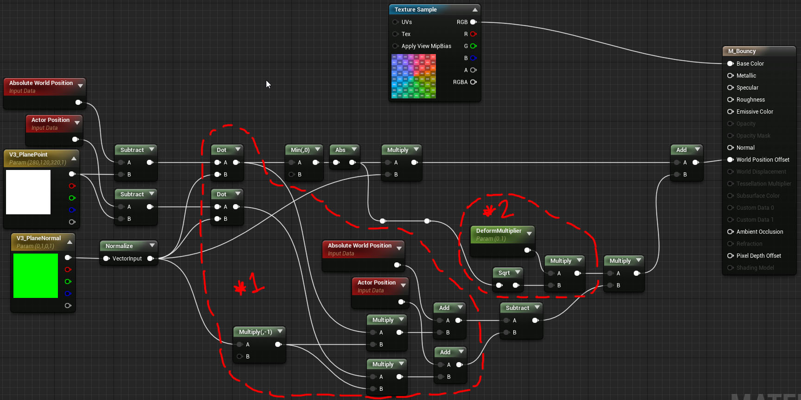

# Squishy material breakdown

I wanted to replicate the effect you get when you press a squishy material against a glass window. Like pressing your
face against the glass of a fish tank, and seeing what it looks like from the inside. I ended up calling the material
"bouncy" during making, which is probably a misnomer, but anyway here's what it'll look like:

The exercise here is basically displacing vertices, so I've broken down the task into 2 parts:
*   An **orthogonal** (in relation to the instigator plane) displacement factor
*   A **parallel** (in relation to the instigator plane) displacement factor

## Orthogonal displacement

#### Quick maths

The 2 things we need answered to build this effect are:
*   Has our object intersected with the instigator plane?
*   How much has our object clipped through the plane? (For each "particle" of our object)

Well, first we begin with a couple of truths: **vector projection** and **dot product**, and make a simple deduction to
get the length of the projection without knowing the angle between both vectors:

Applying that to our case, here's how we obtain the distance between a particle (or vertex) in our object's surface and
the instigator plane:

In fact, since we derive our distance from a dot product, we can also tell when our object's crossed the plane
boundaries just by looking at the sign of the value:

This gives us the numerical amount of displacement we'll need. To get a direction, we just multiply it by the plane
normal; since we only want to displace when clipping through the plane, this is the direction that takes our vertex
back towards the boundary. We're ready to write the shader.

#### Material graph

Highlighted are the nodes related to operations I didn't exactly talk about so far:

1.  Since it's up to us to provide a vector of length 1, we use `Normalize` just to make sure
2.  Since we'll only displace when clipping through (negative value), we do a `Min` with `0`, so the vertex won't be
affected when it's not touching the plane
3.  It's important to know the sign (`+` or `-`) to identify when clipping happens, but the displacement must be
positive (*towards* some direction, not *away* from it) so we do an `Abs`
4.  As mentioned before, the `Dot` operation gave us a scalar distance value, but we're displacing a vertex in 3D space
and we need a proper 3D vector or direction, so we `Multiply` with the plane normal, which is exactly the direction we
want to go back to when clipping through the plane

Create a material instance from the base material we have so far so that you can customize `V3_PlaneNormal` and
`V3_PlanePoint` more easily. This is what we have:

## Parallel displacement addition

#### Quick maths

To "squish" the surface we also need to "spread" it, and we probably want to do it from the center of our object towards
the edges of the contact area. For our editor sphere, this center can be the actor position. We project both surface and
center vectors onto the plane and do a subtraction to get the direction `T`:

Just remember that both `D1` and `D2` are exactly the distances we learned how to calculate in the previous section.

#### Quick maths

So we know how to get the direction for this displacement, but how about the amount? Well, I used a value proportional
to the amount we displaced the vertex orthogonally to the plane in the previous section. I just didn't want it to be
*linearly* proportional, so I used a `Sqrt` and multiplied by a scalar parameter that I can use to control it in the
instance (click to expand):

The graph looks considerably bigger, but not at all more complex:

1.  This is most of the math for calculating the projected points; nothing new here, just maybe more redundant
2.  This is what I use to control the parallel displacement amount; attenuate the amount obtained from the orthogonal
displacement, and multiply by a scalar param that I can tweak in the editor

So here's what we got, finally:

## Notes

*   The model used is a simple editor sphere, you can find it in the `Modes` plane
*   The wall or "instigator plane" is a simple editor box, stretched and squeezed, with a default **wireframe
material,** I just made it two-sided
*   The texture I sampled in the shader is a simple checker texture I found on the web, I'm including the PSD file here
and you can import it directly into unreal
*   A natural step forward for this is **making the plane dynamic**, that is, setting the point and normal parameters
during runtime; it's mostly actor behavior code so I didn't cover it here, but **you can set material parameters during
runtime** and if you feel willing, it's an excellent exercise
